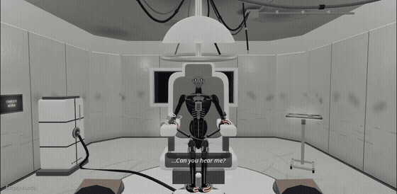

<div align="center">

<h1>protocole.h</h1>

<p><strong>A machine asks you to stop.<br>The game lets you continue.</strong></p>

<p>First-person sci-fi horror · A room, a robot, and the choices you make</p>

<p><a href="#play-locally">Play locally</a> · <a href="#what-the-ai-does">The AI behind it</a> · <a href="#controls">Controls</a></p>



<p><sub>Edited in-game capture. The GIF is silent; the game is not.</sub></p>

</div>

## Welcome, operator.

The room is spotless. The tools are ready. The machine is restrained.

Your assignment sounds simple: perform a maintenance review of **Unit H**. Restore its power. Inspect its damaged components. Decide what to do with the restraints.

Then it speaks.

Not like a tutorial. Like someone hoping you know what you're doing.

**Repair it. Restrain it. Push it. Or listen.** The difference between maintenance and cruelty can be one more second with your finger on the button.

There is no visible morality meter. No dialogue option labelled “good.” Unit H reacts to what you do, and the room keeps a record.

**You came to evaluate a machine. Pay attention to what it learns about you.**

## Same tools. Different intentions.

- **Help and harm share the same controls.** Recharge a failing system or push it past its limit. Remove an obstruction or pull the cable beside it.
- **Unit H has a voice, not just a damage bar.** It offers guidance, warns you, and remembers earlier harm. You can put the tools down and talk to it.
- **The room is part of the performance.** Lights flicker, mechanisms stir, and sounds from beyond the glass turn a routine procedure into something less certain.
- **The ending has receipts.** Your recorded actions shape the conclusion. Replaying means trying a different relationship with Unit H, not just chasing a higher score.

## Play locally

Requires **Node.js 20+** and a desktop browser with WebGL. Headphones recommended.

From the repository root:

```bash
node server/director-server.mjs --root public --port 5190
```

Open **http://127.0.0.1:5190/** to begin with the prologue. No npm install or build is needed for this route: the cell's browser assets are included in the repository.

### Controls

| Input | Action |
| --- | --- |
| WASD / ZQSD + mouse | Move and look around |
| E | Pick up a highlighted tool or use the review console |
| Hold left click | Use the equipped tool; loosen a restraint |
| Hold right click | Tighten a restraint |
| R | Put the tool down |
| T | Type a message to Unit H |
| M | Toggle sound |
| Escape | Open the pause menu and controls |

Follow the contextual prompts when aiming at an object. The electrical probe has a safe charge range; releasing it matters as much as activating it.

**Content note:** restraint, violence toward a humanoid robot, distress sounds, sudden noises, and flashing lights.

## What the AI does

| Technology | Role in the game |
| --- | --- |
| **Google Gemini** | Directs atmospheric events and generates short, contextual replies using the player's recorded actions and typed messages. |
| **Gradium** | Voices Unit H and the institutional system. The repository includes 60 generated dialogue clips; live replies can also be synthesized. |
| **Three.js + Web Audio** | Renders the procedural, articulated robot and interactive room, with lighting, animation, and reactive sound effects. |
| **Devin** | AI-assisted coding, parallel development, integration, and verification during the hackathon. |

AI shapes the performance, not the interaction rules. Tool outcomes and the action history are handled by local game code. Scripted events, subtitles, and the recorded voice bank provide a fallback when live services are unavailable.

<details>
<summary><strong>Optional live AI setup</strong></summary>

Create a private `.env.local` in the repository root:

```dotenv
GEMINI_API_KEY=your_key_here
GRADIUM_API_KEY=your_key_here
```

Restart the server after adding the keys. Without them, the scripted experience remains available; free-form conversation uses a fallback rather than a live AI answer.

Keys stay on the server and must never be committed. Live mode sends gameplay context and typed messages to the providers and may incur API charges.

</details>

## Current scope

This is a **hackathon prototype**, not a finished commercial release. The current experience is the prologue, the interactive 3D cell, and its concluding sequence. Interaction polish and audio balance are still being refined.

The separate [runner experiment](public/runner/) is **not connected to the cell's outcome** and is not required to play this demo. Earlier plans for generated afterworlds are not part of the current build.

## Team & credits

Created by **[Sc4rville](https://github.com/Sc4rville)** and **[Kusaila / kabylesystem](https://github.com/kabylesystem)** for the **{Tech: Europe} AI Gaming Hack — Paris, September 26, 2026**.

<details>
<summary><strong>Credits & asset provenance</strong></summary>

- The repository began with [Phaser Platformer](https://github.com/remarkablegames/phaser-platformer); its [MIT license](LICENSE) is retained. The current cell is built with Three.js, rather than that original 2D scene.
- Third-party sound-effect sources and licenses are documented in [the audio credits](public/audio/licenses/SOURCES.txt).
- The separate runner retains its own [license notice](public/runner/LICENSE).
- Concept-image provenance is recorded in [the asset handoff](docs/asset-handoff.md). The robot used in the cell is procedural geometry, not a generated image presented as a 3D model.

Sound-bank CC0 notices do not apply to the soundtrack or generated voices; those assets have separate provenance and terms.

</details>

---

<div align="center"><strong>The method is yours.</strong></div>
